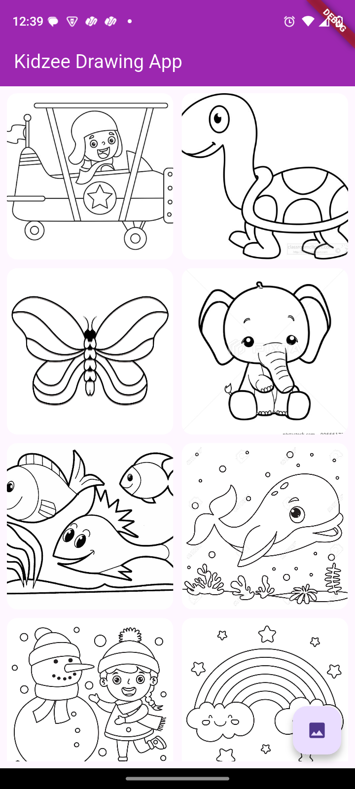
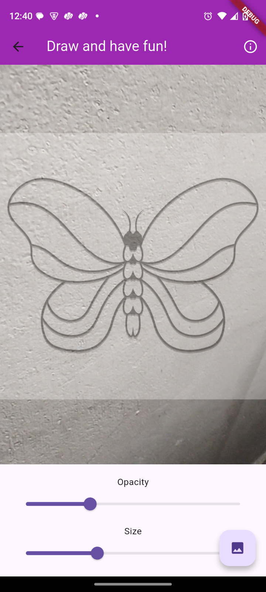
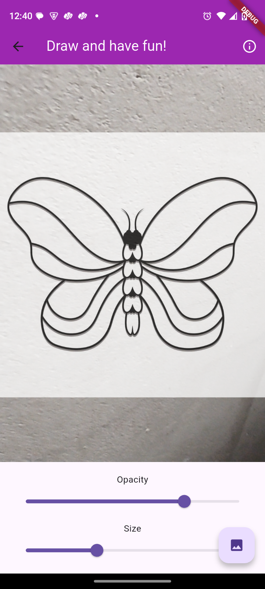

# Kids Drawing App

A fun and creative drawing app that helps kids trace images using their phone camera.

📌 Description

The Kids Drawing App allows children (and beginners) to learn drawing by tracing.
Users can choose from built-in images or pick their own photos, adjust size and opacity, and trace over them using their phone’s camera.

This makes it easier for kids to practice proportions, improve hand control, and have fun while learning art.

🚀 Features

📷 Trace using camera – overlay images on paper and trace them in real-time.

🖼️ Choose images – select from multiple built-in images.

📂 Use local photos – upload your own photos for tracing.

↔️ Size adjustment – resize images to fit the drawing area.

🌫️ Opacity adjustment – control transparency for easy tracing.

🎨 Kid-friendly interface – simple, clean, and intuitive UI.

🛠️ Tech Stack

-Flutter (cross-platform UI framework)
-Dart (programming language)

## 📸 Screenshots

### Home Screen

### Tracing Feature

### Adjusting Opacity

### Adjusting Opacity
